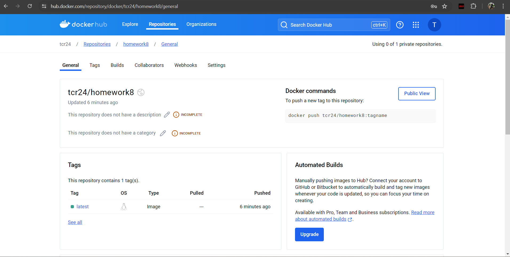

### Tristan Rubiano Homework 8: DevOps - Automated Builds Pushing to DockerHub

## Overview

This project generates a QR code that links to my GitHub homepage using Python and Docker. The CI/CD workflow tests, builds, and pushes the Docker image to DockerHub.

## Setup

### Prerequisites

- Docker installed on your machine
- A Docker account

### Screenshot

